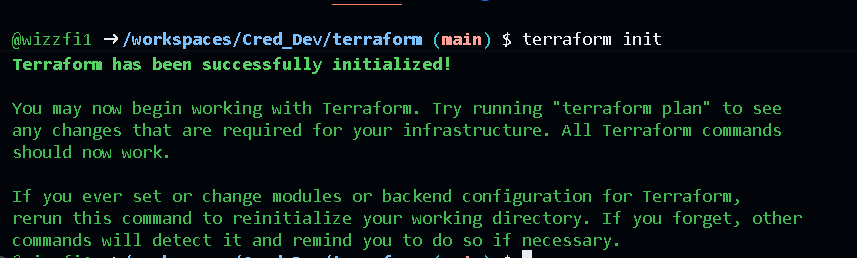
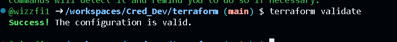

# DevOps Assessment – Production-Ready Node.js Application

## Overview

This repository contains a simple Node.js application and a complete DevOps setup designed to demonstrate containerization, CI/CD, infrastructure as code, and production-readiness practices.

The goal of this project is not application complexity, but to show how a basic service can be packaged, tested, built, and deployed in a clean and secure way.

The application exposes the following endpoints and runs on port **3000**:

- `GET /health`
- `GET /status`
- `POST /process`

---

## Application

The application is a minimal Express-based Node.js service.

### Endpoints

- **GET /health**  
  Used for container and load balancer health checks.

- **GET /status**  
  Returns basic runtime information such as uptime and timestamp.

- **POST /process**  
  Accepts a JSON payload and simulates a processing step.

---

## Running Locally

### Prerequisites

- Docker  
- Docker Compose  

### Steps

1. Create a local environment file:

```bash
cp .env.example .env
```

2. Build and run the stack:

```bash
docker compose up --build
```

3. Access the application:

```bash
curl http://localhost:3001/health
```

> Note: In local development (e.g. GitHub Codespaces), the application is exposed on port `3001` to avoid host port conflicts.  
> Internally, the container still runs on port `3000`.

---

## Containerization

- Multi-stage Docker build to reduce image size  
- Non-root user inside the container  
- Explicit health check using `/health`  
- Environment-driven configuration  
- PostgreSQL included via Docker Compose for local development  

The Docker build context is scoped to the application directory to keep builds deterministic and avoid unnecessary files.

---

## CI/CD Pipeline

CI is implemented using **GitHub Actions** and runs on:

- Pull requests to `main`  
- Pushes to `main`
- CI workflows use path filtering to skip runs for documentation-only changes, reducing unnecessary pipeline executions while still validating all code changes. 

### Pipeline steps

- Install Node.js dependencies  
- Run a minimal test placeholder to validate CI wiring  
- Build the Docker image  
- Push the image to **GitHub Container Registry (GHCR)**  

Images are tagged as:

- `ghcr.io/<owner>/<repo>:latest`  
- `ghcr.io/<owner>/<repo>:<commit-sha>`  

The pipeline is build-only by design. Deployment is handled separately.

---

## Infrastructure as Code (Terraform)

Infrastructure is defined using Terraform and targets **AWS**.

### Provisioned resources

- VPC with public subnets  
- Application Load Balancer (HTTPS)  
- ECS Fargate cluster and service  
- Security groups with least-privilege rules  
- Rolling deployment configuration  

### Validation

The Terraform configuration was validated locally using:

```bash
terraform init
terraform validate
```

The infrastructure was **not applied** as part of this assessment to avoid provisioning real cloud resources. Applying the configuration would require valid AWS credentials and an ACM certificate ARN.


### Terraform Validation Evidence

The following commands were run locally to validate the Terraform configuration:

- `terraform init`
- `terraform validate`

Screenshots are included below for reference.




---

## Deployment Strategy

- The application is deployed as an ECS Fargate service  
- Rolling deployments are enabled via ECS:  
  - Minimum healthy percent: 50%  
  - Maximum percent: 200%  
- This ensures zero downtime during new releases  
- Production deployment can be gated using manual approvals (e.g. GitHub Environments or a dedicated deploy workflow)
- A separate deploy-to-prod GitHub Actions workflow is included to represent a manually approved production deployment, demonstrating CI/CD separation and deployment gating without automatically provisioning cloud resources.
---

## Security Considerations

- No secrets are committed to the repository  
- Local secrets are managed via `.env`  
- CI uses GitHub-provided tokens  
- Containers run as a non-root user  
- HTTPS is enforced at the load balancer  
- Security groups restrict traffic to required ports only  

In a full production setup, secrets would be managed using AWS Secrets Manager or Parameter Store.

---

## Observability

- Basic application logging via stdout  
- Logs are configured to be sent to CloudWatch Logs in ECS  
- Health checks are implemented at:  
  - Application level (`/health`)  
  - Load balancer target group  
  - Container health check  

This provides sufficient visibility for a service of this scope.

---

## Assumptions and Trade-offs

- The focus was on infrastructure and delivery, not application complexity  
- Tests are intentionally minimal due to scope and time constraints  
- Infrastructure is designed to be production-capable but not fully hardened (e.g. no autoscaling or WAF)  
- Terraform is included for design clarity rather than live provisioning  

---

## What I Would Improve With More Time

- Add proper integration tests with short-lived services in CI  
- Introduce autoscaling policies for ECS  
- Add structured logging and metrics  
- Use AWS Secrets Manager for runtime secrets  
- Add blue/green deployments using ALB listener rules  

---

## Conclusion

This project demonstrates a complete, production-aware DevOps workflow for a simple service, covering containerization, CI/CD, infrastructure as code, security, and deployment strategy.

The emphasis is on clarity, correctness, and realistic engineering trade-offs.
